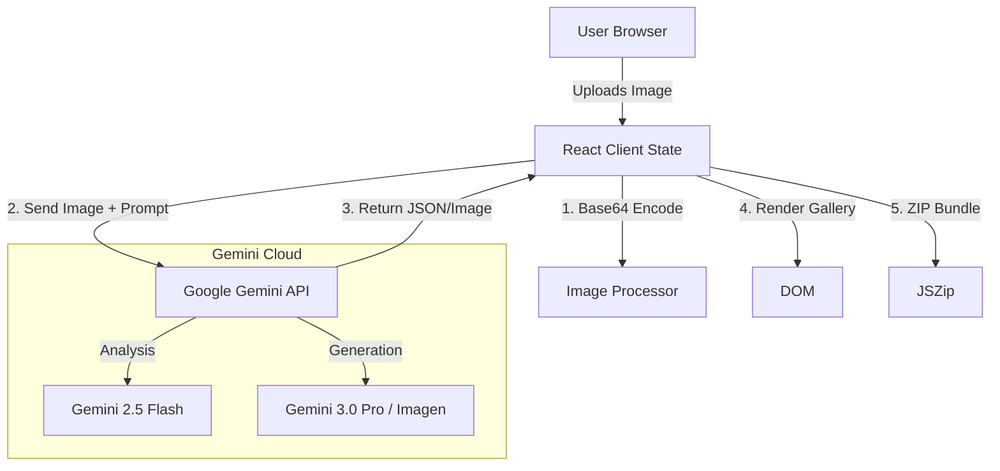

# System Architecture Overview

## High-Level Design
MockupGenius AI is a **Serverless, Client-Heavy Single Page Application (SPA)**. It relies on the browser for orchestration and Google's GenAI API for heavy lifting.

## Core Components

### 1. Client (React + Tailwind)
- **State Management:** Local React State (`useState`, `useRef`). No Redux needed for current scope.
- **UploadZone:** Handles file drag-and-drop and validation.
- **Controls:** Form inputs mapping to `types.ts` enums.
- **Gallery:** Displays results, handles local filtering and sorting.

### 2. Service Layer (`geminiService.ts`)
- **Analyzer:** Calls `gemini-2.5-flash` to extract semantic meaning from the screenshot.
- **Prompt Engineer:** Dynamically constructs complex prompts based on state settings.
- **Generator:** Calls `gemini-3-pro-image-preview` or `2.5-flash-image` for the final asset.

### 3. Data Flow
1.  User uploads file -> Converted to Base64.
2.  `analyzeAppScreenshot` sends Base64 to Gemini -> Returns JSON metadata (colors, category).
3.  UI updates with suggestions.
4.  User clicks "Generate".
5.  `generateMockup` constructs the "Dual-Layer" prompt.
6.  Gemini returns generated image buffer.
7.  `generateSEOMetadata` runs in parallel to create text assets.
8.  Results merged into `GeneratedImage` object and appended to Gallery.
